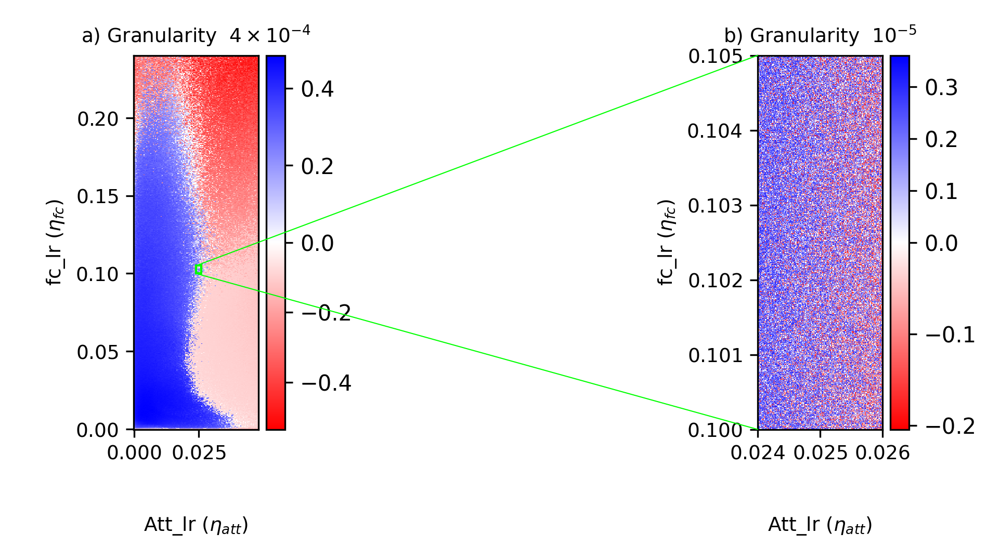
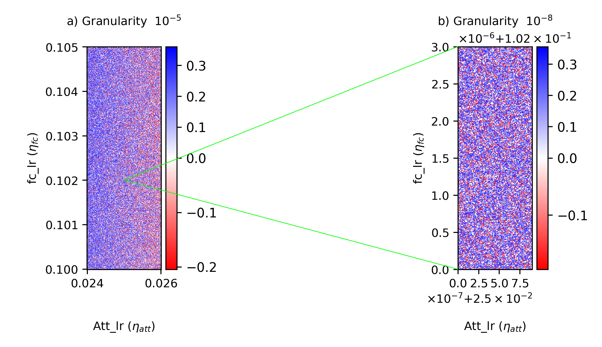
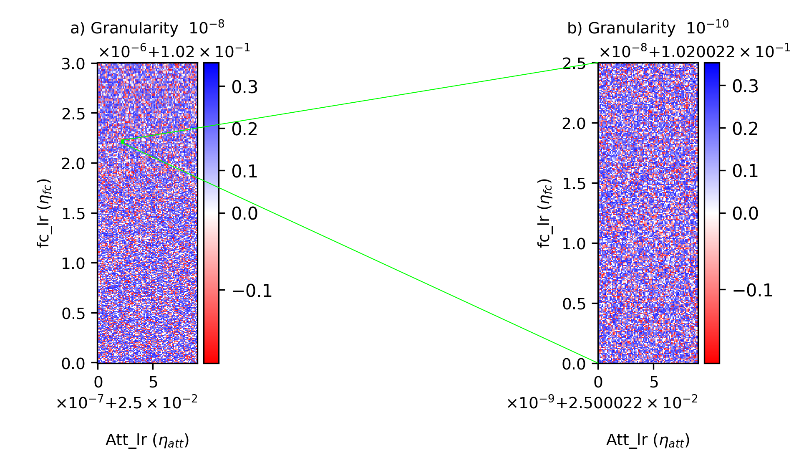
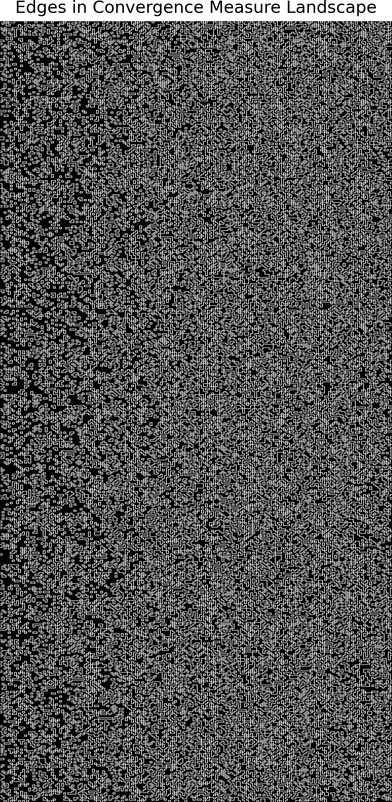
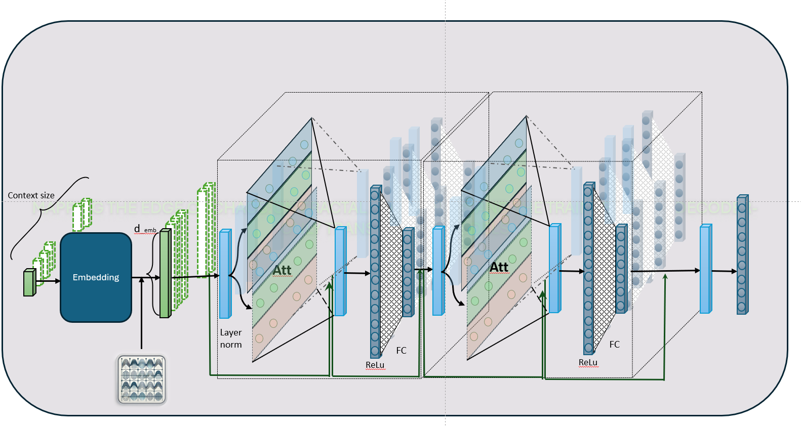

# Mapping the Edge of Chaos

**Fractal-Like Boundaries in The Trainability of Decoder-Only Transformer Models**

This repository contains code from the study *Mapping the Edge of Chaos: Fractal-Like Boundaries in The Trainability of Decoder-Only Transformer Models*. The project explores how subtle adjustments in hyperparameters—particularly learning rates for attention versus fully connected layers—can push training dynamics from convergence into divergence, revealing intricate fractal-like boundaries.

## Overview

Training large-scale language models is a delicate balancing act. Drawing inspiration from fractal geometry, this work investigates the “edge of chaos” where the convergence behavior of a decoder-only transformer is highly sensitive to hyperparameter choices. By mapping the hyperparameter landscape with a novel convergence measure, the experiments uncover self-similar, chaotic boundaries that repeat across scales.

  

## Summary

The paper demonstrates that:
- The boundary between stable (convergent) and unstable (divergent) training regimes exhibits chaotic characteristics.
- A consistent convergence measure is defined—based on the loss function’s behavior to evaluate training stability.
- Experiments reveal that slight adjustments in learning rates (for attention and fully connected layers) lead to a complex partitioning of the hyperparameter space.

## LLM Architecture 

- Using a decoder-only transformer model (with 95,973 trainable parameters) trained on character-level data from Shakespeare’s works, the study visualizes these boundaries.

   

- **Input Tokens:** Sequences of token with a length of 64.
- **Embedding Layer:**
  - Maps tokens to embeddings.
- **Positional Encoding:**
  - Adds positional information to embeddings.
- **Transformer Layers (2 layers):**
  - **Within Each Layer:**
    - Layer Normalization
    - Two-Head Self-Attention
    - Residual Connection
    - Layer Normalization
    - Feed-Forward Network (2 layers with ReLU and linear activations)
    - Residual Connection
- **Final Layer Normalization:**
  - Normalizes the output from the last transformer layer.
- **Output Layer:**
  - Projects normalized outputs to vocabulary logits.
